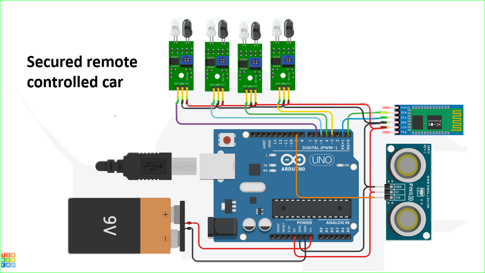

# Secure-Remote-Controlled-Car

## Features :
   * Blutooth controlled
   * Edge Avoidance
   * Abstacle Avoidance

## Instructions :

   * do not change Tx and Rx pin 
   * insatall <AFMotor.h> <NewPing.h>

## software using 
   * Arduino ide (for coding )
   * tinker cad (for circuit diagram)

https://github.com/adithyahk46/Secure-Remote-Controlled-Car/assets/113534275/407cab4c-63d8-46d5-af69-c32239992544

